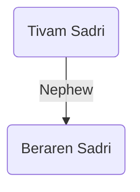

### [UESP](https://en.uesp.net/wiki/Morrowind:Tivam_Sadri)

***
### Modded
Beraren Sadri is a monk at the Holamayan Monastery. He is [[tivam-sadri|Tivam Sadri]]'s nephew. He studied temple artifacts before joining the Dissident Priests and is their foremost expert on the subject. He used to make regular petitions to the Tribunal Temple for permission to wear the Face of Revelation openly. After he is killed in the Shrine of Azura, [[a-torn-page|a torn page]] can be found on his corpse.

### Quests
* Aspect of Azura[^1] <svg xmlns="http://www.w3.org/2000/svg" width="24" height="24" viewBox="0 0 24 24" fill="none" stroke="currentColor" stroke-width="2" stroke-linecap="round" stroke-linejoin="round" class="lucide lucide-pin"><path d="M12 17v5"/><path d="M9 10.76a2 2 0 0 1-1.11 1.79l-1.78.9A2 2 0 0 0 5 15.24V16a1 1 0 0 0 1 1h12a1 1 0 0 0 1-1v-.76a2 2 0 0 0-1.11-1.79l-1.78-.9A2 2 0 0 1 15 10.76V7a1 1 0 0 1 1-1 2 2 0 0 0 0-4H8a2 2 0 0 0 0 4 1 1 0 0 1 1 1z"/></svg> <svg xmlns="http://www.w3.org/2000/svg" width="24" height="24" viewBox="0 0 24 24" fill="none" stroke="currentColor" stroke-width="2" stroke-linecap="round" stroke-linejoin="round" class="lucide lucide-skull"><circle cx="9" cy="12" r="1"/><circle cx="15" cy="12" r="1"/><path d="M8 20v2h8v-2"/><path d="m12.5 17-.5-1-.5 1h1z"/><path d="M16 20a2 2 0 0 0 1.56-3.25 8 8 0 1 0-11.12 0A2 2 0 0 0 8 20"/></svg>
	* At the request of his uncle, Beraren will send the player to acquire [[azura|Azura]]'s Servant. While the player is gone, Beraren steals the Face of Revelation. Following this, Tivam will send the player to kill his nephew and retrieve the mask.

[^1]: [[aspect-of-azura|Aspect of Azura]]