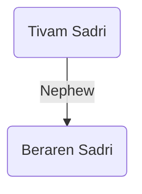

### [UESP](https://en.uesp.net/wiki/Morrowind:Holamayan#Beraren_Sadri)

***
### Modded
Tivam Sadri is a priest at the Holamayan Monastery. He is [[beraren-sadri|Beraren Sadri]]'s uncle.

### Quests
* Aspect of Azura[^1]
	* Suggests the player gain Azura's favor by completing her Daedric quest. Then will send the player to talk to his nephew, Beraren, about the Face of Revelation.

[^1]: [[aspect-of-azura|Aspect of Azura]]